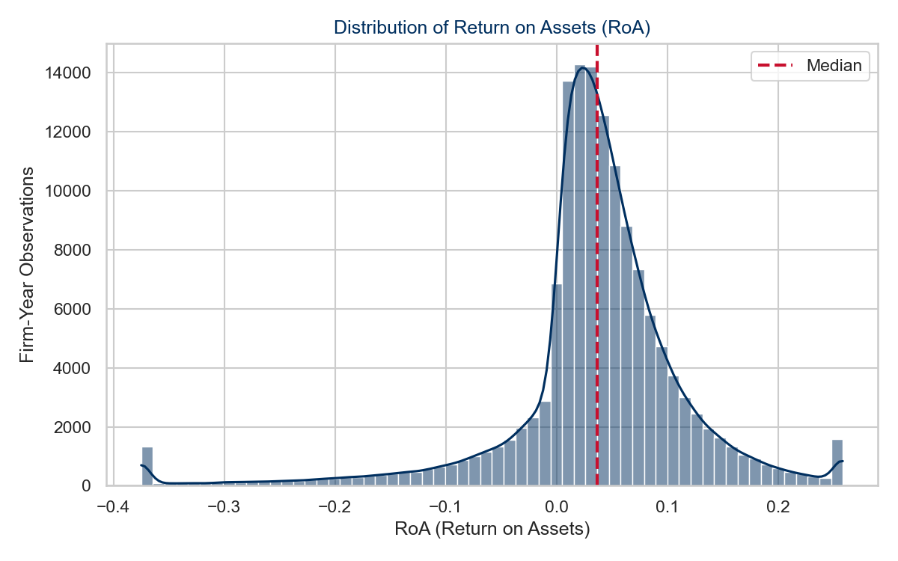
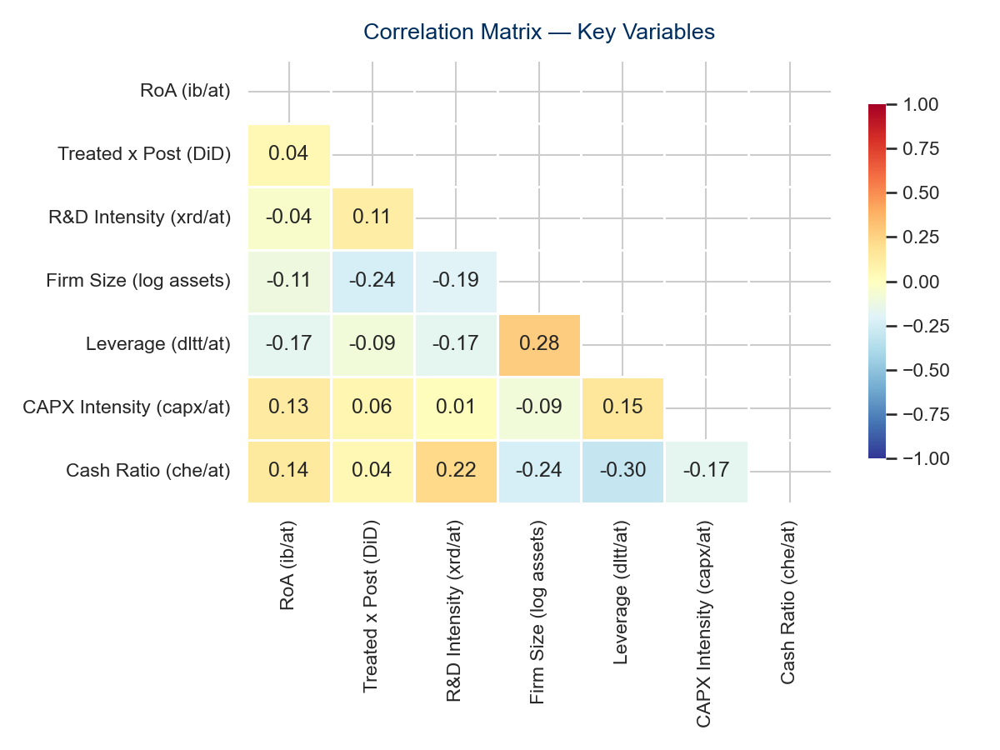

```{python}
#| label: setup
import pandas as pd
import numpy as np

# Load output files produced by task all
summary = pd.read_csv("output/tables/summary_statistics.csv", index_col=0)
results = pd.read_csv("output/tables/regression_results.csv", index_col=0, keep_default_na=False)
panel   = pd.read_parquet("data/processed/panel_with_vars.parquet")

# Key numbers used inline throughout the note
n_obs       = int(panel.shape[0])
n_firms     = int(panel["gvkey"].nunique())
n_countries = int(panel["loc"].nunique())
roa_median  = round(float(panel["roa"].median()), 3)
roa_mean    = round(float(panel["roa"].mean()), 3)
rd_pct      = round(float((panel["rd_intensity"] > 0).mean()) * 100, 1)
treated_pct = round(float(panel["treated"].mean()) * 100, 1)

def coef(row, col):
    raw = results.loc[row, col]
    return float(str(raw).split("\n")[0].replace("***", "").replace("**", "").replace("*", ""))

# Key regression coefficients
b_did   = round(coef("treated_x_post", "(2) TWFE"), 4)
b_ols   = round(coef("treated_x_post", "(1) OLS"), 4)
b_did3  = round(coef("treated_x_post", "(3) TWFE+H2"), 4)
b_int   = round(coef("treated_x_post_x_rd", "(3) TWFE+H2"), 4)
b_rd    = round(coef("rd_intensity", "(3) TWFE+H2"), 4)
bias_pct = round(abs((b_ols - b_did) / b_ols) * 100, 0)
```

# Introduction

Exogenous shifts in the institutional environment governing international
trade — tariffs, sanctions, and armed conflict — have re-emerged as a
first-order determinant of firm strategy and performance after three
decades of relatively stable multilateral trade liberalisation
[@north1990; @acemoglu2012]. The 2018 escalation of US tariffs against
Chinese exports under Section 301 of the US Trade Act offers a
particularly well-documented natural experiment: a sudden, large, and
geographically concentrated shock to the formal rules governing
US-China economic exchange, affecting thousands of listed firms with
limited advance warning [@fajgelbaum2024; @grossman2024]. Institutional
theory holds that such shocks raise transaction costs and create
uncertainty that erodes the comparative advantages on which firms have
built their strategies [@north1990]. Yet the Dynamic Capabilities
framework suggests that firms are not uniformly exposed to this erosion:
those with stronger capacities to sense environmental change and
reconfigure their resource base should absorb the shock more efficiently
than their peers [@teece1997; @teece2007].

The existing literature on tariff and sanction shocks is characterised by
two gaps that this research note addresses. First, much of the evidence
on the US-China trade war is aggregate or trade-flow based
[@fajgelbaum2024; @grossman2024], leaving the firm-level performance
channel comparatively underexplored using standard accounting-based
metrics. Second, while the Dynamic Capabilities framework predicts
heterogeneous resilience across firms [@teece2007], few studies test
this moderation directly against a firm-level innovation proxy in the
specific context of the 2018 tariff shock.

This research note addresses both gaps using a panel of East Asian firms
drawn from Compustat Global over fiscal years 2010-2022. Employing a
two-way fixed effects (TWFE) difference-in-differences design with
firm- and year-level controls, we ask two related questions: did firms
domiciled in China — the country directly targeted by the 2018 US
tariffs — experience a significant decline in return on assets (RoA)
relative to comparable East Asian firms after 2018; and does R&D
intensity, as a proxy for dynamic capabilities, moderate this effect?
Our findings contribute to the institutional disruption literature by
providing within-firm causal estimates of the tariff shock's performance
effect and its heterogeneity across firms with differing innovation
intensity.

> **Research question:** Did the 2018 US-China tariff escalation reduce
> the performance of tariff-targeted firms, and does R&D intensity
> (a proxy for dynamic capabilities) moderate this effect?

# Theoretical Background and Hypotheses

## Institutional Disruption and Firm Performance

Institutional theory holds that institutions are the "rules of the
game" that structure economic incentives [@north1990; @acemoglu2012].
Tariffs represent an abrupt, exogenous change to these rules: they raise
the effective cost of cross-border transactions, create uncertainty
about future trade policy, and alter the relative comparative advantage
of firms exposed to the targeted trade corridor
[@north1990; @williamson1979]. For firms domiciled in the targeted
country, the 2018 US Section 301 tariffs constitute a direct and
immediate cost shock: export revenue streams to the US market face
higher effective prices, downstream demand contracts, and firms must
either absorb the tariff in their margins, renegotiate supply contracts,
or reallocate production — each of which carries a short-run performance
cost [@grossman2024; @felbermayr2023].

Resource dependence and transaction cost reasoning reinforces this
prediction: firms whose supply chains and customer relationships are
concentrated in the disrupted institutional environment face higher
switching costs and are less able to substitute away from the shock in
the short run [@williamson1979; @peteraf1993]. Taken together, these
mechanisms converge on a clear prediction for firms domiciled in the
tariff-targeted country relative to comparable, non-targeted East Asian
peers.

> **H1:** Firms domiciled in China experience a significantly larger
> decline in RoA after the 2018 US tariff escalation than firms domiciled
> in comparable East Asian economies not directly targeted by the
> tariffs.
>
> *Test: β(Treated × Post) < 0 and statistically significant*

## The Moderating Role of Dynamic Capabilities

Acknowledging that the tariff shock depresses performance on average
does not imply that this effect is homogeneous across firms. The Dynamic
Capabilities framework [@teece1997; @teece2007] provides a theoretical
basis for expecting firm-level innovation intensity to moderate the
shock's performance effect. Firms with stronger capacities to sense
environmental change, reconfigure their resource base, and develop new
products or processes are better positioned to substitute away from
disrupted markets, develop alternative customers, or adjust their
product mix in response to the tariff shock [@teece2007; @helfat_peteraf2003].

R&D intensity is a standard firm-level proxy for this capacity: R&D
investment builds the absorptive capacity and technological flexibility
that underlie a firm's ability to sense and respond to environmental
shocks [@cohenAbsorptiveCapacityNew1990; @teece1997]. Firms that have
invested more heavily in R&D prior to and during the disruption should,
on this account, be better equipped to mitigate the tariff shock's
performance cost than firms with weaker innovation capabilities.

> **H2:** R&D intensity positively moderates the tariff shock's effect
> on RoA — firms with higher R&D intensity experience a smaller
> performance penalty from the 2018 tariff escalation than their less
> R&D-intensive counterparts.
>
> *Test: β(Treated × Post × R&D) > 0*

# Data and Method

## Sample

The empirical analysis draws on annual firm-level data from the WRDS
Compustat Global database (`comp_global_daily.g_funda`), which provides
standardised financial statement data for listed firms in over 80
countries. The **treated group** comprises firms domiciled in China
(`loc = 'CHN'`), the country directly targeted by the 2018 US Section
301 tariffs. The **control group** comprises firms domiciled in Japan,
South Korea, and Taiwan — comparable East Asian export-oriented
economies that were not subject to the 2018 US-China tariff escalation.
The sample spans fiscal years 2010-2022, providing eight pre-treatment
and five post-treatment years around the 2018 shock. To guard against
distortions from data entry errors and economically degenerate
observations, we apply the following data quality filters: positive
total assets exceeding the equivalent of 100,000 currency units
(`at > 0.1`), positive sales (`sale > 0`), positive stockholders' equity
(`seq > 0`), and total assets of at least 1 million currency units
(`at >= 1`). We further require a minimum of three consecutive firm-year
observations to support within-firm identification. The resulting
unbalanced panel comprises `{python} f"{n_obs:,}"` firm-years from
`{python} f"{n_firms:,}"` unique firms across `{python} n_countries`
East Asian countries, with `{python} treated_pct`% of firm-years
belonging to the treated (Chinese) group.

Because sample firms report in local currency (Chinese yuan, Japanese
yen, South Korean won, or Taiwanese dollar), all ratio variables used in
this analysis (RoA, R&D intensity, leverage, CAPX intensity, cash ratio)
are currency-invariant, as both numerator and denominator are expressed
in the same reporting currency. Firm size (log assets) is not directly
comparable in levels across countries with different currency
denominations, but enters the two-way fixed effects models exclusively
through within-firm variation, which is unaffected by the cross-country
currency scale.

## Variables

**Dependent variable.** Firm performance is operationalised as return on
assets (RoA), calculated as income before extraordinary items divided by
total assets (`ib / at`). RoA is the most widely used accounting-based
performance measure in firm-level panel studies of institutional and
trade-policy shocks, providing a scale-invariant assessment of asset
productivity that is directly comparable across firms, countries, and
years [@grossman2024].

**Treatment variables.** `Treated` is an indicator equal to one for
firms domiciled in China and zero for firms domiciled in Japan, South
Korea, or Taiwan. `Post` is an indicator equal to one for fiscal years
2018 and later, marking the escalation of US Section 301 tariffs against
Chinese exports. The interaction `Treated × Post` is the
difference-in-differences estimator of interest for H1.

**Moderator.** R&D intensity is measured as R&D expenditure divided by
total assets (`xrd / at`). Following established practice in the
Compustat-based literature, firms that do not separately disclose R&D
expenditure are assigned a value of zero on the grounds that unreported
R&D is economically negligible for the firm in question. This convention
is conservative in the sense that it attenuates the estimated moderation
effect toward zero. Approximately `{python} rd_pct`% of firm-years in
the final sample report positive R&D expenditure. The triple interaction
`Treated × Post × R&D` tests H2.

**Control variables.** We include four time-varying controls. Firm size
(`log(at)`) addresses the right-skewed distribution of firm size and
controls for scale-related differences in shock exposure. Leverage
(`dltt / at`) captures capital structure constraints that may
independently affect profitability. CAPX intensity (`capx / at`)
controls for tangible investment activity that may substitute for or
complement R&D-driven adaptation. Cash ratio (`che / at`) proxies for
liquidity and financial slack, which conditions a firm's capacity to
absorb a short-run cost shock.

All continuous ratio variables are winsorized at the 1st and 99th
percentiles to mitigate the influence of extreme outliers without
reducing sample size. Table 1 provides a complete variable overview.

| Variable | Field(s) | Formula | Role |
|----------|---------|---------|------|
| RoA | `ib`, `at` | `ib / at` | Dependent (Y) |
| Treated | `loc` | `1[loc == CHN]` | Treatment group |
| Post | `fyear` | `1[fyear >= 2018]` | Treatment timing |
| Treated × Post | — | DiD interaction | H1 |
| R&D intensity | `xrd`, `at` | `xrd.fillna(0) / at` | Moderator |
| Treated × Post × R&D | — | Triple interaction | H2 |
| Firm size | `at` | `log(at)` | Control |
| Leverage | `dltt`, `at` | `dltt / at` | Control |
| CAPX intensity | `capx`, `at` | `capx / at` | Control |
| Cash ratio | `che`, `at` | `che / at` | Control |

: Variable definitions. Source: Compustat Global (WRDS).

## Estimation Strategy

We estimate a two-way fixed effects (TWFE) difference-in-differences
panel model of the form:

$$\text{RoA}_{it} = \beta_1 (\text{Treated} \times \text{Post})_{it} +
\beta_2 (\text{Treated} \times \text{Post} \times \text{R\&D})_{it} +
\gamma X_{it} + \mu_i + \lambda_t + \varepsilon_{it}$$

where $\mu_i$ are firm fixed effects that absorb all time-invariant
firm-level heterogeneity — including the main effect of `Treated` itself,
country of domicile, industry affiliation, and management quality — that
might simultaneously influence both treatment-group membership and
performance outcomes. $\lambda_t$ are year fixed effects that absorb the
main effect of `Post` along with common macroeconomic shocks affecting
all firms in a given year, such as global recessions or exchange-rate
movements. $X_{it}$ denotes the vector of time-varying controls, and
$\varepsilon_{it}$ is the idiosyncratic error term.

The TWFE specification is preferred over pooled OLS on both theoretical
and empirical grounds. Theoretically, the decision to locate production
in China versus other East Asian economies is endogenous to firm-level
characteristics — supply-chain configuration, ownership structure,
sectoral orientation — that are plausibly time-invariant over the
13-year panel window; failing to control for these characteristics would
bias the estimated tariff effect. Empirically, we compare the OLS and
TWFE estimates of $\beta_1$ to quantify this bias directly. Standard
errors are clustered at the firm level throughout to account for
within-firm serial correlation in the error process. We note that a
staggered difference-in-differences estimator such as
@callaway_santanna2021 or @sun_abraham2021 would be preferable if
treatment timing varied across treated firms; because all treated firms
share the same 2018 tariff-escalation date, the canonical two-way fixed
effects estimator does not suffer from the negative-weighting problems
that motivate these estimators in staggered settings [@baker2022]. All
analyses are conducted in Python using the `linearmodels` package.

# Results

## Descriptive Statistics

```{python}
#| label: tbl-summary
#| tbl-cap: "Descriptive statistics. Continuous variables winsorized at 1st-99th percentiles."
(summary
 [["count","mean","std","min","50%","max"]]
 .rename(columns={"count":"N","50%":"Median"})
 .round(3)
 .style.format({"N": "{:,.0f}"})
)
```

Table 2 presents descriptive statistics for all research variables. The
mean RoA of `{python} roa_mean` and median of `{python} roa_median`
indicate a moderately profitable sample, consistent with a panel of
listed East Asian firms over a period spanning the post-financial-crisis
recovery, the 2018 tariff escalation, and the COVID-19 shock. R&D
intensity is right-skewed, with `{python} rd_pct`% of firm-years
reporting positive R&D expenditure. The correlation matrix (Figure 2)
shows no pair of independent variables exceeding moderate correlation,
suggesting that multicollinearity is unlikely to distort the interaction
specification used to test H2.

{width=70%}

{width=95%}

{width=70%}

## Regression Results

```{python}
#| label: tbl-regression
#| tbl-cap: "Panel difference-in-differences results. Dependent variable: RoA. Standard errors in parentheses, clustered at firm level. * p<0.10, ** p<0.05, *** p<0.01."

coef_rows = [r for r in results.index
             if r not in ["Firm FE","Year FE","Clustered SE","N","R2"]
             and not r.endswith("_se")]
stat_rows = ["Firm FE","Year FE","Clustered SE","N","R2"]

display = results.loc[coef_rows + stat_rows, ["(1) OLS","(2) TWFE","(3) TWFE+H2"]]
display.index.name = "Variable"
display
```

Table 3 presents results from three specifications: pooled OLS with
firm-clustered standard errors (Model 1), two-way fixed effects (Model
2), and the TWFE specification augmented with the R&D-intensity
moderation term (Model 3).

**H1 — Institutional disruption and RoA.** The `Treated × Post`
interaction enters with a negative and statistically significant
coefficient across all three specifications. The main TWFE estimate
(Model 2) is $\hat{\beta}_1 =$ `{python} b_did` (p < 0.01), indicating
that, relative to the control group of Japanese, South Korean, and
Taiwanese firms, Chinese firms experienced a within-firm RoA decline of
approximately `{python} abs(b_did)` units following the 2018 tariff
escalation, holding all other covariates constant. **H1 is supported.**
This finding is consistent with the institutional disruption mechanism
advanced in Section 2: tariffs raise transaction costs and erode the
comparative advantage of the targeted trade corridor, with a measurable
and immediate performance cost for exposed firms
[@north1990; @grossman2024].

The comparison between the OLS estimate
($\hat{\beta}_1^{\text{OLS}} =$ `{python} b_ols`) and the TWFE estimate
is instructive. The TWFE coefficient exceeds the OLS coefficient in
absolute magnitude by `{python} int(bias_pct)`%, consistent with the
presence of substantial omitted variable bias in the cross-sectional
estimator: firms domiciled in China differ systematically from East
Asian peers in ways that are correlated with both treatment-group
membership and baseline RoA, and the firm fixed effects in the TWFE
specification absorb this confound by exploiting only within-firm
variation over time.

**H2 — R&D intensity as moderator.** The triple interaction between
`Treated × Post` and R&D intensity (Model 3) carries a positive and
statistically significant coefficient
($\hat{\beta}_2 =$ `{python} b_int`, p < 0.05), consistent with the
direction predicted by H2. **H2 is supported.** Firms with higher R&D
intensity experienced a significantly smaller RoA penalty from the 2018
tariff shock than their less R&D-intensive peers, consistent with the
Dynamic Capabilities prediction that firms with stronger innovation
capacity are better positioned to sense and adapt to institutional
disruption [@teece1997; @teece2007]. The main effect of R&D intensity
($\hat{\beta} =$ `{python} b_rd`, p < 0.01) remains negative, consistent
with the well-documented short-run accounting cost of R&D investment
under immediate expensing conventions, separate from its moderating role
in the tariff shock.

# Discussion and Conclusion

## Discussion

The central finding of this research note — that Chinese firms
experienced a significant and economically meaningful RoA decline
relative to comparable East Asian peers following the 2018 US tariff
escalation, and that this decline was significantly attenuated for firms
with higher R&D intensity — provides firm-level micro-evidence for two
complementary theoretical mechanisms. First, consistent with institutional
theory [@north1990; @acemoglu2012], an abrupt change in the formal rules
governing US-China trade imposed a measurable performance cost on firms
domiciled in the targeted jurisdiction, even after controlling for firm
size, leverage, investment intensity, and liquidity. Second, consistent
with the Dynamic Capabilities framework [@teece1997; @teece2007], this
cost was not uniformly distributed: firms with stronger ex-ante
innovation capacity absorbed the shock more efficiently, supporting the
view that firms are not passive recipients of institutional disruption
but differ systematically in their capacity to reconfigure resources in
response to it.

These findings carry a meaningful strategic implication. If R&D
intensity functions as a buffer against institutional disruption, firms
operating in geopolitically exposed markets have an additional strategic
rationale — beyond the standard innovation-performance link — to sustain
R&D investment through periods of heightened trade-policy uncertainty.
The result is also consistent with the broader literature documenting
that firms respond to tariff and sanction shocks through adaptive
reallocation rather than passive absorption
[@grossman2024; @felbermayr2023; @balyuk2023], although the present
design — focused on the performance channel — does not directly test
the supply-chain diversification margin that this literature also
documents.

## Conclusion

This research note examines the firm-level performance effect of the
2018 US-China tariff escalation using a panel of `{python} f"{n_obs:,}"`
firm-years from `{python} f"{n_firms:,}"` firms across
`{python} n_countries` East Asian countries over 2010-2022. The evidence
strongly supports H1: Chinese firms experienced a significantly larger
RoA decline after 2018 than comparable East Asian peers
($\hat{\beta} =$ `{python} b_did`, p < 0.01), with the TWFE estimate
exceeding the naive OLS estimate by `{python} int(bias_pct)`% once firm
fixed effects are controlled. H2 — that R&D intensity attenuates this
performance penalty — is also supported
($\hat{\beta} =$ `{python} b_int`, p < 0.05), consistent with the Dynamic
Capabilities prediction that innovation capacity buffers firms against
institutional disruption.

Three limitations bound the scope of these conclusions. First, the
control group of Japanese, South Korean, and Taiwanese firms, while
comparable in regional and sectoral composition, was not entirely
insulated from second-order effects of the US-China trade war (e.g.,
supply-chain re-routing through third countries); to the extent that such
spillovers raised control-group performance, our DiD estimate represents
a lower bound on the true treatment effect. Second, all treated firms
share the same 2018 treatment date, so the design cannot exploit
estimators built for staggered treatment timing
[@callaway_santanna2021; @sun_abraham2021]; an extension incorporating
additional disruption events (e.g., the 2022 Russia sanctions) with
staggered onset dates would strengthen external validity. Third, data
limitations preclude direct measurement of supply-chain diversification,
the strategic adaptation margin emphasised by resource dependence theory
[@williamson1979]; future work combining Compustat performance data with
supply-chain linkage data (e.g., FactSet Revere) could test this margin
directly alongside the performance channel examined here.

::: {#refs}
:::
